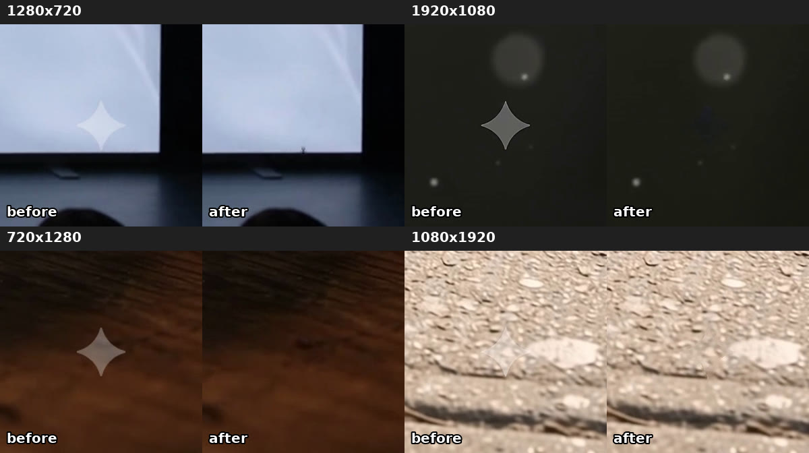

# Google Vids watermark remover: take the Gemini ✦ off Google Vids videos

Every video made in Google Vids, including the ones from the [Google Vids API](https://useapi.net/docs/api-google-vids-v1?utm_source=github.com&utm_medium=referral&utm_campaign=google-vids-api), carries a visible Gemini sparkle (✦) in the bottom-right corner. `vids_watermark_remover.py` takes it out and gives you back the original pixels.



Full clips before and after, at `720p` and `1080p`: the [launch clip](https://useapi.net/docs/articles/google-vids-influencer-avatars#6-the-launch-two-avatars-and-the-product-in-one-clip) and [the pigeon](https://useapi.net/docs/articles/google-vids-influencer-avatars#a-pigeon-in-aeroloops) in our Google Vids tutorial.

## How it works

The sparkle is a white four-pointed star laid over the video at about 30% opacity. When you know exactly where it is, what shape it has and how transparent it is, the blend can be undone pixel by pixel:

```
original = (frame - opacity * white) / (1 - opacity)
```

This is reverse alpha blending, the same method as the general Gemini watermark tools. The difference is that the star's position, shape and opacity here were measured on hundreds of Google Vids clips, for every Vids format. The general tools target Gemini and Veo output. The one we tried on Vids clips, `gwmr`, worked at 720p but missed the mark at 1080p. After the reverse blend, the script smooths only the star's thin outline, so no edge is left. Nothing is painted in by AI.

- All four Vids formats: 1280×720, 720×1280, 1920×1080 and 1080×1920. The star scales with the frame's short side.
- Only the small area around the star changes. The rest of every frame is re-encoded at high quality (CRF 18 by default), and the audio is copied unchanged.
- In our test, a 10-second clip took about 7 seconds at 720p and 20 seconds at 1080p.
- The invisible SynthID watermark that Google also embeds is not affected.

**Works on clips as generated, and on upscales of them. It does not work on extended or edited clips.** An extend or an edit gives the already-marked clip back to the model, which regenerates the whole video and repaints the star into the picture, softened and reshaped in every frame, before Google stamps a new one on top. The new stamp comes off, but the repainted star stays as a faint diamond. To keep a long video clean, remove the mark from each clip you generate rather than from an extended one.

Where the star sits on a very sharp edge, such as a bright screen against a black border, a few pixels at its tip can stay slightly off.

## Usage

You need [Python](https://www.python.org) 3.8 or newer, `numpy`, and [ffmpeg](https://ffmpeg.org/download.html) (with `ffprobe`) on your `PATH`.

```bash
pip install numpy
python3 vids_watermark_remover.py my-clip.mp4
# → my-clip_clean.mp4

python3 vids_watermark_remover.py my-clip.mp4 out.mp4 --crf 16
```

`--crf` sets the x264 quality (lower is better, default 18) and `--preset` the x264 speed preset (default `medium`).

## Notes

- The measurements are from Google Vids clips of October 2026 (Gemini Omni 1.1 Flash). If Google changes the mark, the numbers at the top of the script need measuring again: open an issue.
- Google Vids images have no visible mark, so this is for videos only.
- Download your clips with [GET /media/`mediaId`](https://useapi.net/docs/api-google-vids-v1/get-google-vids-media-mediaId?utm_source=github.com&utm_medium=referral&utm_campaign=google-vids-api) and run the script on the file.
